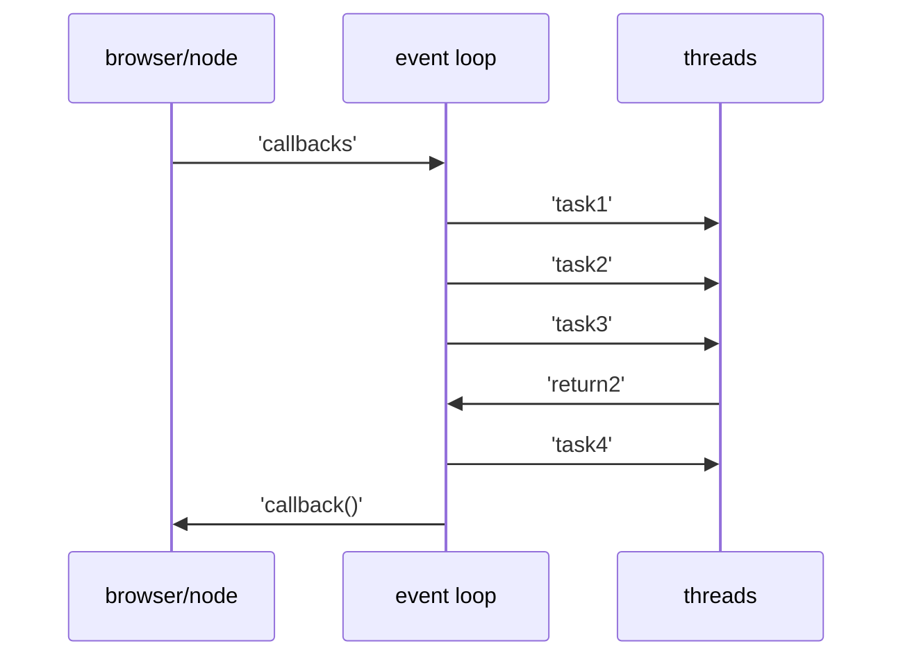

# 简答题

## 谈谈你是如何理解 JS 异步编程的，EventLoop、消息队列都是做什么的，什么是宏任务，什么是微任务？

**答:**

- JavaScript 是单线程运行的一个程序，所以当 JavaScript 运行的时候 HTML 会停止渲染。为了实现 非阻塞(non-blocking)，不让页面在处理耗时的功能，如 I/O,Ajax 等，处于空白页面太久，所以 JavaScript 在设计的初衷就分为了同步事件和异步事件两个部分。

  - 同步事件

    也就是所有的代码按序执行的部分，在 栈(call stack) 中被执行

  - 异步事件

    不按序执行的部分，一般会作为回调函数被放入 事件池(event loop) 中去处理。中间的处理是通过 消息队列(message queue) 来实现的。当 callback 没有被 event loop 处理的时候，他们就在 msg queue 中等待，等到 signal triggered 了之后，被放入 event loop 中去处理。

    在 event loop 中处理完毕的 callback 也会被放入 msg queue 中，直到另一个 signal trigger 了之后被放入 call stack 被执行。

- Event Loop 就是实际上处理 callbacks 的部分，这一块是多线程的。
- msg queue 是一个存储着所有未被处理和已经处理完毕的 callbacks 的 queue，等到合适的 signal 被 trigger 了，msg queue 中的 callbacks 或是会进入 event loop 中被执行，或者是等到 call stack 中被直接调用。
- Macro vs Micro

  两个 tasks 都在 msg queue 中占有单独的一条线路。

  - Macrotasks

    - event loop 的一次循环中只会有一个 macrotasks queue
    - 函数包括 setTimeout, setInterval,I/O 之类的

  - Microtasks

    - 当 event loop 中的 macrotask 执行完毕后，会立刻执行所有的 microtasks
    - 函数包括 process.nextTick, Promises 等

