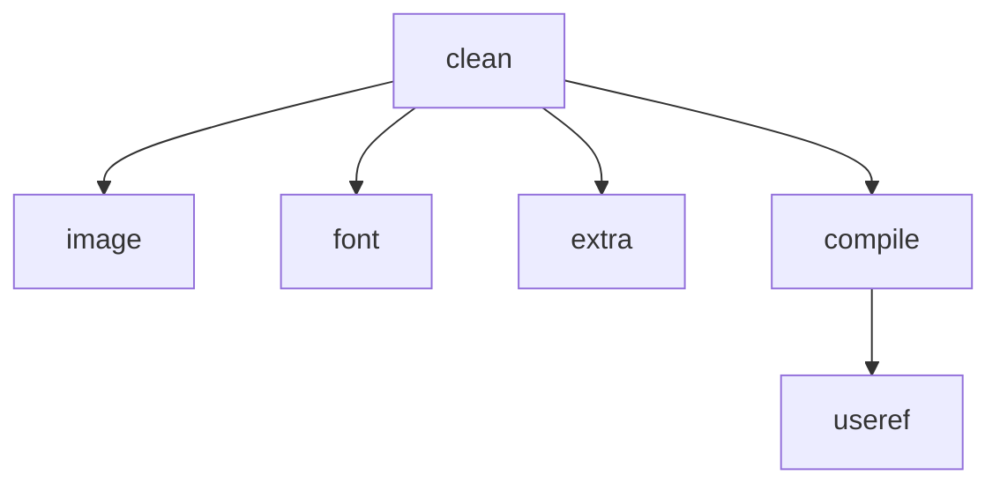

# gulp 文档解说

关于 gulp 的更细致的讲解，可以参考上文：[逐步详解如何使用 gulp 去进行自动化构建](https://goldenaarcher.blog.csdn.net/article/details/118010756)。不看问题也不大，都是手把手地实现，也会带注释。

做任何项目或者是实现功能的第一步，都是分析需求

## 分析需求

已知项目的结构如下：


其中：

- public 下面的内容是不需要经过任何处理，可以直接打包上传
- assets 中是需要处理的文件，包括：

  - fonts，字体文件，需要被压缩
  - images，图片文件，需要压缩
  - scripts，脚本文件，需要压缩

    根据需求，可能需要编译（通过 babel）到指定 es 版本

  - styles，样式文件，需要压缩

    根据需求，可能需要编译——将 scss/sass 文件编译成为 css 文件

- layout，html 文件，存在模板引擎内容，需要被编译
- partials，html 文件，存在模板引擎内容，需要被编译

这样就是一个网页项目打包的需求了，有了需求，接下来就一步步的去实现内容即可。

## 构建项目

### 准备工作

#### 下载 gulp

第一步先下载并安装 gulp：

```bash
yarn add gulp --dev
```

#### 新建 gulpfile.js

在 gulp 安装完成后，在根目录下新建一个 gulpfile.js，作为 gulp 操作的入口。

所有建立的函数都会做为私有函数的方式进行实现，然后将需要被导出的函数统一通过 `module.exports` 实现，语法大致如下：

```javascript
const privateFunc = () => {};

const noExport = () => {};

// 只有这一个函数会被导出
const exportFunc = () => {};

module.exports = { exportFunc };
```

#### 引入所需要的函数

```javascript
const { src, dest } = require("gulp");
```

其中，`src` 会作为文件的写入流，`dest` 会作为文件的写出流。

### 样式编译

#### 样式文件的 io

读取 `src/assets/styles` 所有的文件，再写出到 `dist` 目录下同样的位置。

实现代码如下：

```javascript
// 样式编译
const style = () => {
  // base 的作用是为了保留项目结构，不将所有的文件全都写入到 dist 文件夹下
  return src("src/assets/styles/*.scss", { base: "src" }).pipe(dest("dist"));
};

module.exports = {
  style,
};
```

此时在命令行运行样式的编译命令：

```bash
gulp-sample> yarn gulp style
```

写出的结果就生成了：


#### 样式文件的编译

基础的 IO 实现了，现在就开始实现将 scss 转译为 css 的功能，这个功能的视线需要借助插件来完成，所以先安装插件：

```bash
gulp-sample> yarn add gulp-sass --dev
```

介入 gulp-sass 的使用，大部分 gulp-插件 的使用都是通过 pipe 函数，在写入流之前实现。并且大部分的提供的功能是函数，直接调用即可。

```javascript
// 新增引用
const sass = require("gulp-sass");

// 样式编译
const style = () => {
  return (
    src("src/assets/styles/*.scss", { base: "src" })
      // 通过 pipe 使用 sass 功能
      // outputStyle 用于展开花括号，使得编写更加流程化
      .pipe(sass({ outputStyle: "expanded" }))
      .pipe(dest("dist"))
  );
};
```

再次运行编译后得出的项目结构如下：


可以注意到有以下 2 个问题：

1. 多余的 scss 文件没有被清理掉

   这是因为目前还没有完成清理部分的代码，这个在后面会实现，先暂时手动删除掉多余的文件

2. 只有一个 main.css 文件被编译了

   这并不是什么错误，根据 Stack Overflow 有个提问：

   [Why put in front of the file name “_” or “_” in scss/css?](https://stackoverflow.com/questions/34889962/why-put-in-front-of-the-file-name-or-in-scss-css#:~:text=The%20_%20%28underscore%29%20is%20a%20partial%20for%20scss.,everything%20will%20be%20compiled%20on%20a%20single%20file.)

   其中的答复说到：

   > The \_ (underscore) is a partial for scss. That means the stylesheet its going to be imported (@import) to a main stylesheet i.e. styles.scss. The advantage on using partials is that you can use many files to organize your code and everything will be compiled on a single file.

   大概意思是说，`_.scss` 文件是部分内容，用于分开处理不同的逻辑，使用时通过 `@import` 导入。最终会被编译进一个 css 文件。

所以暂时先将多余的 scss 文件删除掉，编译后获得一个干净的目录：


### 脚本编译

脚本的任务也需要新增一个函数去执行，这样可以比较好的拆分组件功能。文件的 io 上一步在 样式编译 部分已经实现了，这里就直接先下载所需的插件，然后进行功能的实现。

- 依赖下载

  ```bash
  gulp-sample> yarn add gulp-babel --dev
  pages-boilerplate> yarn add @babel/core @babel/preset-env --dev
  ```

  babel 只是提供了一个平台，具体的功能还是需要按照需求下载

  - core 是核心组件

  - preset-env 一个 JavaScript 的转换插件，安装后可以指定编译为指定的 JavaScript 版本，如 es2021

    它包含了最新的 JavaScript 的版本

目前来说对于 babel 的配置都是非常简单的，比较复杂的业务需求建议还是通过新建一个 .babelrc 文件，然后在配置文件中实现

- 功能实现

  ```javascript
  // 新的引用
  const babel = require("gulp-babel");

  // 脚本编译
  const script = () => {
    return src("src/assets/scripts/*.js", { base: "src" })
      .pipe(babel({ presets: ["@babel/preset-env"] }))
      .pipe(dest("dist"));
  };

  module.exports = {
    style,
    script,
  };
  ```

- 运行脚本并查看结果

  ```bash
  # 注意这里要运行的是 script
  pages-boilerplate> yarn gulp script
  ```

  查看结果：

    

### 页面模板编译

为了能够实现页面最大的可复用程度，在 HTML 文件中使用了一些模板引擎，如：


单独打开这个页面是无法获得正确被渲染，因此在 gulp 中也要处理一下模板引擎的内容。

- 安装插件

  这里使用的模板引擎是 swig，因此需要安装对应的 gulp 插件

  ```bash
  pages-boilerplate> yarn add gulp-swig --dev
  ```

- 功能实现

  ```javascript
  const swig = require("gulp-swig");

  const swigData = {
    pageTitle: "name",
  };

  // 页面编译
  const page = () => {
    // 只编译根目录下的html，不包含子目录的html，如 layout, partial 等
    return (
      src("src/*.html", { base: "src" })
        // swigData 是一些需要模板引擎转译的变量
        .pipe(
          swig({
            swigData,
            defaults: {
              // 默认不缓存文件，可能会存在热更新失败问题
              // 为之后的热更新做准备
              cache: false,
            },
          })
        )
        .pipe(dest("dist"))
    );
  };

  module.exports = {
    style,
    script,
    page,
  };
  ```

- 运行脚本并查看结果

  ```bash
  pages-boilerplate> yarn gulp page
  ```

  可以看到所有的 html 已经成功写出

    

  而且内容也已经成功地被编译了：

    

  一些变量名，如 pageTitle 也会被编译成功

至此，主体内容就已经编译完成了

### 创建组合任务

日常来说，JavaScript, CSS 和 HTML 的编译都是放在一起的，因此可以新建一个组合子任务去将三个任务组合在一起。

实现：

```javascript
const { src, dest, parallel } = require("gulp");

const compile = parallel(style, script, page);

module.exports = {
  compile,
};
```

这样就可以直接通过运行 compile 去完成组合任务了：

```bash
pages-boilerplate> yarn gulp compile
[03:33:59] Using gulpfile C:\assignment\front\lagoufed-e-task\part2\fed-e-task-02-01\code\pages-boilerplate\gulpfile.js
[03:33:59] Starting 'compile'...
[03:33:59] Starting 'style'...
[03:33:59] Starting 'script'...
[03:33:59] Starting 'page'...
[03:34:01] Finished 'script' after 1.78 s
[03:34:01] Finished 'page' after 1.79 s
[03:34:01] Finished 'style' after 1.79 s
[03:34:01] Finished 'compile' after 1.8 s
Done in 4.24s.
```

可以看到，在调用了 compile 任务之后，compile 分别调用了 style, script 和 page 去分别进行编译任务

### 图片和字体文件转换

老规矩，安装插件，实现功能，和运行结果

#### 图片的压缩

- 安装插件

  ```bash
  # 图片处理插件
  # 这个我最终还是用cnpm下成功了，yarn和npm都不行
  pages-boilerplate> yarn add gulp-imagemin --dev
  ```

- 功能实现

  ```javascript
  const imagemin = require("gulp-imagemin");

  // 图片转换
  const image = () => {
    // 这里使用了 ** 通配符，去匹配 images 下的所有文件
    return src("src/assets/images/**", { base: "src" })
      .pipe(imagemin())
      .pipe(dest("dist"));
  };

  module.exports = {
    compile,
    image,
  };
  ```

- 运行结果

  ```bash
  pages-boilerplate> yarn gulp image
  [09:33:50] Using gulpfile
  [09:33:50] Starting 'image'...
  [09:33:52] gulp-imagemin: Minified 2 images (saved 23.1 kB - 26.7%)
  [09:33:52] Finished 'image' after 1.9
  ```

  可以看到，图片被压缩了 26.7%，这里的压缩是无损压缩，并不会损坏图片的清晰度，只是会去除一些文件格式的声明

#### 字体的压缩

字体压缩的函数和图片压缩是一样的，这里主要是针对 SVG 进行压缩。

- 功能实现

  ```javascript
  // 字体转换
  const font = () => {
    return src("src/assets/fonts/**", { base: "src" })
      .pipe(imagemin())
      .pipe(dest("dist"));
  };

  module.exports = {
    compile,
    image,
    font,
  };
  ```

- 运行结果

  ```bash
  pages-boilerplate> yarn gulp font
  [09:35:57] Using gulpfile C:\assignment\front\lagoufed-e-task\part2\fed-e-task-02-01\code\pages-boilerplate\gulpfile.js
  [09:35:57] Starting 'font'...
  [09:35:58] gulp-imagemin: Minified 1 image (saved 693 B - 6%)
  [09:35:58] Finished 'font' after 1.12 s
  Done in 3.03s.
  ```

  可以看到，字体也被压缩一些了

最终结果：


可以看到 fonts 和 images 都被拷贝到了 dist 目录中去

这时候只需要做一下最后的清理，将 image 和 font 任务加到 compile 中去即可：

```javascript
const compile = parallel(style, script, page, image, font);

module.exports = {
  compile,
};
```

### 其他文件及文件清除

#### 添加其他文件

其他文件指的是将 public 中的文件复制黏贴到 dist 目录下中，并且结合一下 compile，生成一个新的组合任务。

- 功能实现

  ```javascript
  // cv public下的文件
  const extra = () => {
    return src("public/**", { base: "public" }).pipe(dest("dist"));
  };

  // 二次组合，分离 compile 和 extra 的业务逻辑
  const build = parallel(compile, extra);

  module.exports = {
    build,
  };
  ```

- 运行结果

  ```bash
  pages-boilerplate> yarn gulp build
  [03:56:01] Starting 'build'...
  [03:56:01] Starting 'extra'...
  [03:56:01] Starting 'style'...
  [03:56:01] Starting 'script'...
  [03:56:01] Starting 'page'...
  [03:56:01] Starting 'image'...
  [03:56:01] Starting 'font'...
  [03:56:05] gulp-imagemin: Minified 2 images (saved 23.1 kB - 26.7%)
  [03:56:05] Finished 'style' after 4.06 s
  [03:56:05] Finished 'extra' after 4.07 s
  [03:56:05] Finished 'script' after 4.07 s
  [03:56:05] Finished 'page' after 4.07 s
  [03:56:05] gulp-imagemin: Minified 1 image (saved 693 B - 6%)
  [03:56:05] Finished 'image' after 4.08 s
  [03:56:05] Finished 'font' after 4.08 s
  [03:56:05] Finished 'build' after 4.09 s
  Done in 5.74s.
  ```

最终结果：


可以看到这是后多出了一个 favicon.ico，这是从 public 文件夹下复制进来的。

#### 文件清除

这里也会用到一个额外的依赖包：del，所以依旧老步骤走起。

- 安装依赖包

  ```bash
  pages-boilerplate> yarn add del --dev
  ```

- 功能实现

  ```javascript
  const del = require("del");

  // 添加对 series 的引用
  const { src, dest, parallel, series } = require("gulp");

  // 删除 dist 中的所有内容
  const clean = () => {
    return del(["dist"]);
  };

  // 三次组合，先用 series 进行对 dist 的删除，再调用 parallel 去分别执行任务
  // parallel 拆分的任务是为了分离 compile 和 extra 的业务逻辑
  const build = series(clean, parallel(compile, extra));
  ```

- 运行结果

  ```bash
  pages-boilerplate> yarn gulp build
  [06:34:58] Starting 'build'...
  [06:34:58] Starting 'clean'...
  [06:34:58] Finished 'clean' after 25 ms
  [06:34:58] Starting 'extra'...
  [06:34:58] Starting 'style'...
  [06:34:58] Starting 'script'...
  [06:34:58] Starting 'page'...
  [06:34:58] Starting 'image'...
  [06:34:58] Starting 'font'...
  [06:35:02] gulp-imagemin: Minified 2 images (saved 23.1 kB - 26.7%)
  [06:35:02] Finished 'style' after 3.74 s
  [06:35:02] Finished 'extra' after 3.74 s
  [06:35:02] Finished 'script' after 3.75 s
  [06:35:02] Finished 'page' after 3.75 s
  [06:35:02] gulp-imagemin: Minified 1 image (saved 693 B - 6%)
  [06:35:02] Finished 'image' after 3.76 s
  [06:35:02] Finished 'font' after 3.77 s
  [06:35:02] Finished 'build' after 3.8 s
  Done in 6.17s.
  ```

  这里截图其实很难说明什么了，不过根据命令行输出可以看出，clean 确实被之行了之后，再去执行打包命令。

### 自动加载插件

伴随着功能的实现，现在使用的插件也越来越多。如果都是通过 `require` 去进行调用的话，那么无疑对后期的管理会有一定的难度。

这里又有一个插件，可以提供对插件引入的管理：gulp-load-plugins

- 安装插件依赖

  ```bash
  pages-boilerplate> yarn add gulp-load-plugins --dev
  ```

- 功能实现

  ```javascript
  const loadPlugins = require("gulp-load-plugins");
  const plugins = loadPlugins();

  // 需要修改下面所有的引用，例如说原本 sass 的地方需要修改为 plugins.sass，以 style 为例
  // 样式编译
  const style = () => {
    return (
      src("src/assets/styles/*.scss", { base: "src" })
        // 这里原本调用的是 sass，现在掉用的是 plugins.sass
        .pipe(plugins.sass({ outputStyle: "expanded" }))
        .pipe(dest("dist"))
    );
  };
  ```

这时候在终端运行一下，效果和之前的是一样的

### 开发服务器

也就是很多的脚手架会封装的热更新功能，这里依旧会用到另外的插件——browser-sync。

- 安装插件

  ```bash
  pages-boilerplate> yarn add browser-sync --dev
  ```

- 功能实现

  ```javascript
  // 热更新功能
  // 非gulp原生功能，所以 plugin 不起作用，还是需要手动引用
  const browserSync = require("browser-sync");
  const bs = browserSync.create();

  const serve = () => {
    bs.init({
      // 根目录，设置的是编译过后的目录
      server: {
        baseDir: "dist",
        // 对于项目中，/node_modules/ 是没有办法寻找到正确的路径的
        // 这里相对于增添一个路由，去寻找到正确的配置
        // 对于 /node_modules 的具体配置，后面会有
        routes: {
          "/node_modules": "node_modules",
        },
      },
      // 监听修改的文件，一单文件被更新，浏览器渲染页面就会同步被渲染
      files: "dist/**",
      // 启动时不跳出 browser sync 已经连接的消息
      notify: false,
      // 指定端口
      port: 2080,
    });
  };

  module.exports = {
    build,
    serve,
  };
  ```

至此，热更新的功能就实现了，下一步要实现的就是一旦 src 目录下的文件被修改了，那么就会自动部署，即，热部署。

### 监视变化以及构建优化

#### 监视变化，热部署

这里会使用 gulp 自带的函数，watch 去实现

- 功能实现：

  ```javascript
  const { src, dest, parallel, series, watch } = require("gulp");

  // 监听所有的文件变化，都是之前写过的函数
  watch("src/assets/styles/*.scss", style);
  watch("src/assets/scripts/*.js", script);
  watch("src/*.html", page);
  watch("src/assets/images/**", image);
  watch("src/assets/fonts/**", font);
  watch("public/**", extra);
  ```

- 运行结果

  这时候一旦弃用了服务器，然后再修改源代码，就会触发以下的变化：

  ```bash
  pages-boilerplate> yarn gulp serve
  [10:03:27] Starting 'serve'...
  [Browsersync] Access URLs:
  -------------------------------------
        Local: http://localhost:2080
      External: http://172.28.160.1:2080
  -------------------------------------
            UI: http://localhost:3001
  UI External: http://localhost:3001
  -------------------------------------
  [Browsersync] Serving files from: dist
  [Browsersync] Watching files...
  [10:05:46] Starting 'page'...
  [10:05:46] Finished 'page' after 237 ms
  [Browsersync] Reloading Browsers... (buffered 2 events)
  [10:05:58] Starting 'page'...
  [10:05:58] Finished 'page' after 142 ms
  [Browsersync] Reloading Browsers... (buffered 2 events)
  ```

对文件的修改会触发对应的任务，从而完成从热更新到热部署的实现。

注：一定要确认 swig 中的 cache 是否设置为 false，如果文件被 swig 缓存了，出于性能的考虑，并不会即时的进行热部署

#### 构建优化

日常开发中对于图片、字体和静态文件的压缩处理需求不是很大，这些更多的是在部署的时候能够减少网页大小而进行的优化作用。对此，可以进行以下的优化：

1. 减少图片、字体压缩引起的编译

   ```javascript
   // 会调用写好的函数，因此要放在函数声明的后面
   const serve = () => {
     // 监听所有的文件变化，都是之前写过的函数
     watch('src/assets/styles/*.scss', style);
     watch('src/assets/scripts/*.js', script);
     watch('src/*.html', page);
     // 图片，字体和 public 的更新不会引起重新编译，只会重新加载页面
     watch(
        ["src/assets/images/**", "src/assets/fonts/**", "public/**"],
        bs.reload
     );


     bs.init({
       server: {
         // baseDir会接受一个数组，具体作用就是在，当文件在较先的index中找不到，会向后顺延，寻找指定的文件
         // 这就代表，在开发阶段中，图片和字体可以不需要在dist中打包，可以在src中直接寻找，可以借此提高构建效率
         baseDir: ['dist', 'src', 'public'],
         routes: {
           '/node_modules': 'node_modules',
         },
       },
       ...
     });
   };
   ```

2. 再构筑一个任务，组合 compile 和 serve

   这是因为对于没有打包过的项目，直接运行寻找 dist 下的文件，即使不会报错(dist 不起作用)，所获得的文件也是未编译的(跳过 dist 直接到 src 中寻找)。

   因此这种情况下可以重新组合一个开发用的命令，按序执行 compile 和 serve 即可

   ```javascript
   // 开发用的任务
   const develop = series(compile, serve);

   module.exports = {
     build,
     develop,
   };
   ```

3. 重构一下 build 任务

   之前的 build 任务只用 compile 和 extra，现在可以把 image 及 font 也加上去

   ```javascript
   // 上线用的任务
   // 三次组合，先用 series 进行对 dist 的删除，再调用 parallel 去分别执行任务
   // parallel 拆分的任务是为了分离 compile 和 其他的 的业务逻辑
   const build = series(clean, parallel(compile, image, font, extra));
   ```

### useref 文件引用处理

useref 也是一个插件，可以处理针对 node_modules 的引用问题。

这是源文件中写入的注释：

```html
<!-- build:css assets/styles/vendor.css -->
<link rel="stylesheet" href="/node_modules/bootstrap/dist/css/bootstrap.css" />
<!-- endbuild -->
<!-- build:css assets/styles/main.css -->
<link rel="stylesheet" href="assets/styles/main.css" />
<!-- endbuild -->
<!-- 省略若干内容 -->
<!-- build:js assets/scripts/vendor.js -->
<script src="/node_modules/jquery/dist/jquery.js"></script>
<script src="/node_modules/popper.js/dist/umd/popper.js"></script>
<script src="/node_modules/bootstrap/dist/js/bootstrap.js"></script>
<!-- endbuild -->
<!-- build:js assets/scripts/main.js -->
<script src="assets/scripts/main.js"></script>
<!-- endbuild -->
```

重点是就是开闭标签中标记的 `build:css` 和 `build:js` 的内容，这可以使用 useref 去动态地读取引用到的文件，并且以指定的名称，如：`vendor.css`，写入指定的文件夹中，如 `assets/styles`。

- 安装依赖

  ```bash
  # 这里直接使用yarn好像没办法从github上下载到依赖包，所以还是使用了cnpm去实现
  pages-boilerplate> cnpm install gulp-useref --save-dev
  ```

  注：gulp-useref 是一个 gulp 的文件，所以可以直接通过 plugins 引用

- 代码实现

  ```javascript
  // 解决 node_modules 引用问题
  const useref = () => {
    return src("dist/*.html", { base: "dist" })
      .pipe(plugins.useref({ searchPath: ["dist", "."] }))
      .pipe(dest("dist"));
  };

  module.exports = {
    build,
    develop,
    // 暂时暴露出去做测试
    useref,
    clean,
  };
  ```

- 运行结果

  能够看到 assets 下的 script 和 styles 多出了新的文件，并且都是之前注视中指定的文件：

  

  而且 html 代码中的路径也变掉了：

  ```html
  <link rel="stylesheet" href="assets/styles/vendor.css" />
  <link rel="stylesheet" href="assets/styles/main.css" />
  ```

  变成了直接对文件的引用，而不是原先的 `/node_modules/filename` 的版本

  注意，原本多个的 js 文件，全都被压缩成了一个 vendor.js

### 文件压缩

现在就需要压缩 html, css 和 javascript 了，这也需要分别使用不同的依赖包去完成

- 安装依赖包

  ```bash
  # 好像哪个依赖包又有问题，需要使用cnpm进行安装
  # 分别对应html，js，和 css
  pages-boilerplate> cnpm install gulp-htmlmin gulp-uglify gulp-clean-css --save-dev
  # 这个是用来判断类型文件的
  pages-boilerplate> cnpm install gulp-if --save-dev
  ```

- 代码实现

  ```javascript
  // 解决 node_modules 引用问题 和 压缩文件
  const useref = () => {
    return (
      src("dist/*.html", { base: "dist" })
        .pipe(plugins.useref({ searchPath: ["dist", "."] }))
        // html css js 的压缩
        // 使用 if 判断是否是 js 文件，是的话就是用 uglify 去压缩
        .pipe(plugins.if(/\.js$/, plugins.uglify()))
        .pipe(plugins.if(/\.css$/, plugins.cleanCss()))
        .pipe(
          plugins.if(
            /\.html$/,
            plugins.htmlmin({
              collapseWhitespace: true,
              minifyCSS: true,
              minifyJS: true,
            })
          )
        )
        // 为了防止文件的读写冲突，存入临时文件夹
        .pipe(dest("temp"))
    );
  };
  ```

- 运行结果

  ```bash
  pages-boilerplate> yarn gulp useref
  [11:25:15] Using gulpfile C:\assignment\front\lagoufed-e-task\part2\fed-e-task-02-01\code\pages-boilerplate\gulpfile.js
  [11:25:15] Starting 'useref'...
  Done in 14.46s.
  ```

  就能看到代码已经被压缩完成了：

  

### 重新规划构建过程

此时的文件结构就产生了一些问题，因为 dist 中应当保存的是上线的文件，但是现在压缩过应该上线的文件，却保存在了 temp 文件夹中。

针对这个问题，应该将 dist 的存储和 temp 的存储进行调换——即将编译好的文件保存在 temp 文件夹中，压缩之后再存入 dist 中。

#### 重构项目步骤

这一步需要改写的函数包括：

- style 中，将 dist 修改为 temp

  ```javascript
  // 样式编译
  const style = () => {
    return src("src/assets/styles/*.scss", { base: "src" })
      .pipe(plugins.sass({ outputStyle: "expanded" }))
      .pipe(dest("temp"));
  };
  ```

- script，将 dist 修改为 temp
- page，将 dist 修改为 temp
- serve，同样将 dist 修改为 temp，主要是在 server 中的 baseDir

  ```javascript
  baseDir: ["temp", "src", "public"],
  ```

- useref 中需要修改的地方较多，基本就是 temp 和 dist 的互换

  ```javascript
  const useref = () => {
    return src("temp/*.html", { base: "temp" })
      .pipe(plugins.useref({ searchPath: ["temp", "."] }))
      .pipe(plugins.if(/\.js$/, plugins.uglify()))
      .pipe(plugins.if(/\.css$/, plugins.cleanCss()))
      .pipe(
        plugins.if(
          /\.html$/,
          plugins.htmlmin({
            collapseWhitespace: true,
            minifyCSS: true,
            minifyJS: true,
          })
        )
      )
      .pipe(dest("dist"));
  };
  ```

- clean

  修改所需要清除的内容，增加 temp 文件夹

  ```javascript
  const clean = () => {
    return del(["dist", "temp"]);
  };
  ```

- build，这个也更加复杂了

  ```javascript
  // 上线用的任务
  // 1. 先用 series 进行对 dist 的删除，再调用 parallel 去分别执行任务
  //    parallel 拆分的任务是为了分离 compile 和 其他的 的业务逻辑
  // 2. 并行进行 compile 和 useref 任务
  //    保证先编译完再压缩
  // 3. 并行进行 编译+压缩，图片，字体和其他文件的写入过程
  const build = series(
    clean,
    parallel(series(compile, useref), image, font, extra)
  );
  ```

### 运行重构项目

```bash
pages-boilerplate> yarn gulp build
[11:48:47] Starting 'build'...
[11:48:47] Starting 'clean'...
[11:48:47] Finished 'clean' after 11 ms
[11:48:47] Starting 'image'...
[11:48:47] Starting 'font'...
[11:48:47] Starting 'extra'...
[11:48:47] Starting 'style'...
[11:48:47] Starting 'script'...
[11:48:47] Starting 'page'...
[11:48:47] Starting 'image'...
[11:48:47] Starting 'font'...
[11:48:51] Finished 'extra' after 4.33 s
[11:48:51] Finished 'script' after 4.02 s
[11:48:51] Finished 'page' after 4.02 s
[11:48:51] Finished 'style' after 4.03 s
[11:48:51] gulp-imagemin: Minified 1 image (saved 693 B - 6%)
[11:48:51] gulp-imagemin: Minified 1 image (saved 693 B - 6%)
[11:48:51] Finished 'font' after 4.04 s
[11:48:51] Finished 'font' after 4.39 s
[11:48:51] gulp-imagemin: Minified 2 images (saved 23.1 kB - 26.7%)
[11:48:51] Finished 'image' after 4.27 s
[11:48:51] Starting 'useref'...
[11:48:52] gulp-imagemin: Minified 2 images (saved 23.1 kB - 26.7%)
[11:48:53] Finished 'image' after 5.93 s
[11:49:01] Finished 'useref' after 9.9 s
[11:49:01] Finished 'build' after 15 s
Done in 16.93s.
```

这里跟着[starting]和[finish]逻辑走一遍的话，也能发现运行过程是这样一个流程：



文件夹结构的对比：

| temp                                                                      | dist                                                                      |
| :------------------------------------------------------------------------ | :------------------------------------------------------------------------ |
|  |  |

这里也能够比较明显的看到，temp 文件夹中只有需要编译的文件，而 dist 的文件夹下是一个完整的、可以直接运行的项目结构

至此，一个完整的构建过程就完成了
