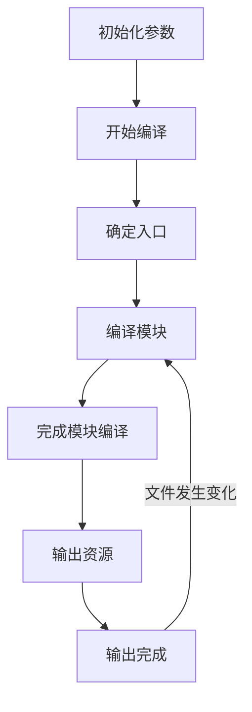

# 答案

## 一、简答题

### 1、Webpack 的构建流程主要有哪些环节？如果可以请尽可能详尽的描述 Webpack 打包的整个过程

在开始了解 WebPack 的构建流程之前，需要了解 WebPack 的几个核心概念：

1. entry

   入口，WebPack 的构建的第一步会从 entry 开始，可抽象成输入

   这里我的理解就是，可以通过命令行指示 WebPack 打包选择什么类型和模式，比如说 dev, uat, production 等

   或是通过对应的命令行调用对应的配置文件，最终开始确认入口

2. module

   模块，在 WebPack 一切皆模块，一个模块对应一个文件，WebPack 会从配置的 entry 开始，递归找出所有依赖的模块。

3. chunk

   代码块，一个 chunk 由多个代码块组成，用于代码的合并和分割。

4. loader

   模块转换器，用于将模块的原本内容按照需求转换成新的内容

5. plugin

   插件，WebPack 最强的功能之一

   在 WebPack 构建的过程流程中会在特定的时机广播对应的事件，插件可以监听到这些事件，然后在特定的时间点做特定的事情

流程的大致走向如下：



其中，每个阶段负责的工作任务如下：

- 初始化参数

  从配置文件 和/或 shell 语句中读取与合并参数，得出最终的参数

- 开始编译

  用上一步得到的参数，初始化 Compiler 对象，加载所有配置的插件，通过执行对象的 run 方法开始执行编译

- 确定入口

  根据配置中的 entry 找出所有入口文件

- 编译模块

  从入口文件触发，调用所有配置的 Loader 对模块进行翻译，再找出该模块依赖的模块，进行递归，直到本步骤所有入口依赖文件都经过这一步的处理

- 完成模块编译

  经过上一步使用 Loader 翻译完所有的模块后，得到了每个模块被翻译后的最终内容以及彼此之间的依赖关系

- 输出资源

  根据入口和模块之间的依赖关系，组装成一个个包含多个模块的 chunk，再将每个 chunk 转换成一个单独的文件加入输出列表中，这是可以修改输出内容的最后机会

- 输出完成

  确定好输出内容后，根据配置确定输出的路径和文件名，将文件的内容写入文件系统中

注：关于 plugin，在上述的过程中会在特定的时间点广播特定的事件，插件会在监听到对应的实践后执行特定的逻辑，并且插件可以调用 WebPack 提供的 API 改变 WebPack 的运行结果。

### 2、Loader 和 Plugin 有哪些不同？请描述一下开发 Loader 和 Plugin 的思路

| Loader                                                                                                                                                                                                                                                                                                                                                                                                                            | Plugin                                                                                                                                                                                                                                                                                                                                    |
| :-------------------------------------------------------------------------------------------------------------------------------------------------------------------------------------------------------------------------------------------------------------------------------------------------------------------------------------------------------------------------------------------------------------------------------- | :---------------------------------------------------------------------------------------------------------------------------------------------------------------------------------------------------------------------------------------------------------------------------------------------------------------------------------------- |
| 加载器，专注实现资源模块的转换和加载                                                                                                                                                                                                                                                                                                                                                                                              | 插件，解决其他自动化工作，用来补充加载器无法实现的功能                                                                                                                                                                                                                                                                                    |
| 开发 Loader 的过程为： <br /> 1. 直接在根目录下新建一个 `xxx-loader.js` 的文件 <br /> 2. 导出一个函数，这个函数就是这个 loader 对资源的处理过程。其输入（source 参数）就是加载的资源，输出（返回值）就是此次加工过后的结果 <br /> 3. 在函数体内使用合适的 loader ——这里的处理过程有些像 pipeline，所以可以套用多个 loader 使用 <br /> 4. 返回处理结果，或是为可以直接使用的 JavaScript 代码，或是需要下一个 Loader 继续处理的内容 | 开发 Plugin 的过程为： <br /> 1. 通过类似于网页开发中事件的钩子机制(hooks)实现 <br /> 2. 通过往每个环节上准备好的钩子挂载插件和任务，可以扩展 WebPack 的能力和功能 <br /> 3. 一个函数或是一个包含 apply 方法的对象 <br /> 4. 方法体内通过 webpack 提供的 API 获取资源做响应处理 <br /> 5. 将处理完的资源通过 webpack 提供的方法返回该资源 |

## 二、编程题

### 1、使用 Webpack 实现 Vue 项目打包任务

具体任务及说明：

1. 在 code/vue-app-base 中安装、创建、编辑相关文件，进而完成作业。
2. 这是一个使用 Vue CLI 创建出来的 Vue 项目基础结构
3. 有所不同的是这里我移除掉了 vue-cli-service（包含 webpack 等工具的黑盒工具）
4. 这里的要求就是直接使用 webpack 以及你所了解的周边工具、Loader、Plugin 还原这个项目的打包任务
5. 尽可能的使用上所有你了解到的功能和特性

<b>提示：(开始前必看)</b>

在视频录制后，webpack 版本以迅雷不及掩耳的速度升级到 5，相应 webpack-cli、webpack-dev-server 都有改变。

项目中使用服务器的配置应该是改为下面这样：

```json
// package.json 中部分代码
"scripts": {
  "serve": "webpack serve --config webpack.config.js"
}
```

vue 文件中 使用 style-loader 即可

**其它问题, 可先到 <https://www.npmjs.com/> 上搜索查看相应包的最新版本的配置示例, 可以解决大部分问题.**

#### 作业要求

本次作业中的编程题要求大家完成相应代码后

- 提交一个项目说明文档，要求思路流程清晰。
- 或者简单录制一个小视频介绍一下实现思路，并演示一下相关功能。
- 最终将录制的视频或说明文档和代码统一提交至作业仓库。
